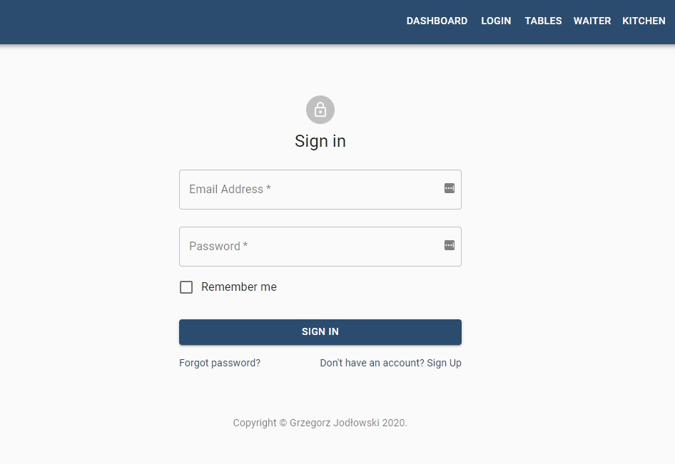

<p align="center">
<a href="https://pizzeria-portal.herokuapp.com/"></a>
</p>


# <p align="center">📈 Pizzeria dashboard</p>
<p align="center">Project for mastering React, Redux, work with API and learn Material design</p>

</br>

## Table of Contents

- [What's this project about?](#about)
- [Technologies used](#technologies)
- [What I learned?](#what)
- [Interesting code snippet](#interesting)
- [Installation](#install)
- [NPM scripts](#npm)
- [GIT hooks](#git)
- [Available URLs](#url)
- [Website (on Heroku)](#site)

</br>

## <a name="about"></a>What's this project about?

This is a website for the pizzeria administration panel that offers login, dashboard, waiter, kitchen, table, orders views. In the application it is possible to change the status of tables, create and edit orders, and handle orders through the kitchen. The entire website is based on the redux state of the application and cooperation with API (Thunk, Axios).

</br>

## <a name="technologies"></a>Technologies used
- HTML
- CSS
- SCSS
- JavaScript
- React
- Redux
- Router
- GIT
- Material-UI
- Axios
- Thunk

</br>

## <a name="what"></a>What I learned?

-
-
- use the [JSON file generator](https://next.json-generator.com/),


</br>

## <a name="interesting"></a>Interesting code snippet (for me of course 😉)
- thunk creator:

```js
export const fetchFromAPI = () => {
  return (dispatch, getState) => {
    dispatch(fetchStarted());

    Axios
      .get(`${api.url}/${api.tables}`)
      .then(res => {
        dispatch(fetchSuccess(res.data));
      })
      .catch(err => {
        dispatch(fetchError(err.message || true));
      });
  };
};
```

- conditional render of the React component:

```js
  render() {
    const { loading: { active, error }, tables } = this.props;

    if (active || !tables.length) {
      return (
        <Paper className={styles.component}>
          <p>Loading...</p>
        </Paper>
      );
    } else if (error) {
      return (
        <Paper className={styles.component}>
          <p>Error! Details:</p>
          <pre>{error}</pre>
        </Paper>
      );
    } else {
      return (
        ...
      )
```

</br>

## <a name="install"></a>Installation

- use the package manager [npm](https://www.npmjs.com/get-npm) or [yarn](https://classic.yarnpkg.com/en/) to install dependencies:

```bash
npm install // yarn install

or

npm i // yarn i
```
- run watch mode to start the server, constantly refreshing and more:

```bash
npm start

or

yarn start
```

<br/>


## <a name="npm"></a>NPM scripts

There are 3 main scripts to speed up work:

- `start`: observes changes in the` src` folder and starts working preview,
- `build`: builds a project in the` build` folder based on files from the `src` and` public` folders,
- `test`: starting the unit tests,

check the additional scripts in the `package.json` file


<br/>


## <a name="git"></a>GIT hooks
The project uses Git Hooks - the ability to run scripts in response to selected Git events.

Each time you execute the `git commit` command, unit tests, formatting, and linting will be run
for files selected with `git add` and to be saved in commit.

<br/>

## <a name="url"></a>Available URLs

- http://localhost:3000/ - live view of the current project - administration panel (`webpack-dev-server`)
- http://localhost:3131/ - pizzeria website for customers
- http://localhost:3131/api - project API url
- http://localhost:3131/api/db - preview of the entire database in the API
- http://localhost:3131/panel - state of the current project (panel) from the moment of starting `yarn start` (this is not a live view)

<br/>

## <a name="site"></a>Website (on Heroku)
[Pizzeria dashboard](https://pizzeria-portal.herokuapp.com/)
- if the page loads slowly, wait a moment, the server is waking up because it is hosted on a free platform Heroku.

</br>
</br>

  *project implemented as part of the 9-month [Web Developer Plus](https://kodilla.com/pl/bootcamp/webdeveloper/?type=wdp&editionId=309) course organized by [Kodilla](https://drive.google.com/file/d/1AZGDMtjhsHbrtXhRSIlRKKc3RCxQk6YY/view?usp=sharing)


